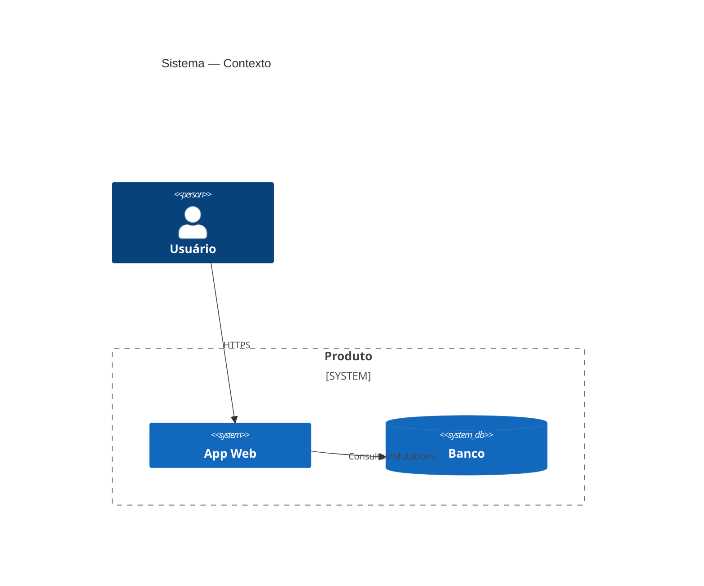

# Mermaid — Snippets

```mermaid
C4Context
title Sistema — Contexto
Person(user, "Usuário")
System_Boundary(sys, "Produto") {
  System(spa, "App Web")
  SystemDb(db, "Banco")
}
Rel(user, spa, "HTTPS")
Rel(spa, db, "Consultas/Mutations")
```
